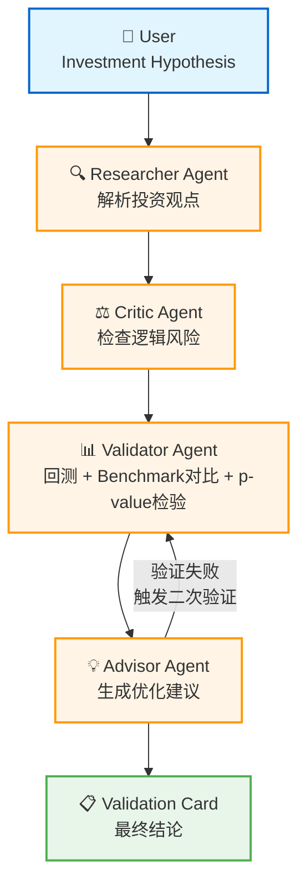

# AlphaPilot：让每一个投资观点都经得起历史检验

## 1. 项目背景

在当前的金融投研领域，大语言模型（LLM）已经能够生成大量看似合理的投资观点。例如："京东方A PB低于1倍时买入"、"某公司PE处于历史低位，值得配置"。然而，这些观点是否真正有效？它们能否在历史数据中站得住脚？

**问题在于：大模型擅长生成观点，但不擅长验证观点。**

这正是我开发 AlphaPilot 的初衷——构建一个 Multi-Agent Investment Research Copilot，能够将自然语言投资观点转化为可量化的交易信号，并通过严格的历史回测和统计检验来验证其有效性。

> **Large models generate opinions; AlphaPilot validates them.**

---

## 2. QoderWork 能力探索

在项目启动阶段，我深入调研了 QoderWork 平台的三层核心能力：**Expert（专家套件）**、**Skill（技能库）** 和 **Connector（连接器）**。

### 2.1 Expert 专家套件

QoderWork 提供了多个垂直领域的专家套件，其中与本项目高度相关的包括：

- **投研分析类**：业绩快评、可比公司分析、深度报告、行业研究、读年报、研报摘要
- **股权投资类**：筛项目、尽调清单、投决备忘录、测收益、退出分析
- **咨询交付类**：写报告、方案框架、标杆对比、桌面调研、访谈纪要、CEO汇报

这些专家套件展示了如何将复杂的专业工作拆解为可自动化的流程，为我设计 Multi-Agent 架构提供了重要参考。

### 2.2 Skill 技能库

Finance Skills 和 Data Analyzer 等技能让我意识到，专业的金融分析需要标准化的输出格式和严谨的统计方法。例如：
- 业绩点评需要包含超预期/低预期判断
- 可比公司分析需要构建估值指标矩阵
- 深度报告需要覆盖行业、商业模式、财务、估值全框架

### 2.3 Connector 连接器

Deep Research 和各类 IM 连接器（钉钉、飞书）展示了如何将 AI Agent 嵌入到真实的工作流中，实现从研究到决策的闭环。

---

## 3. 项目目标

基于以上调研，我确定了 AlphaPilot 的核心目标：

**构建一个 Multi-Agent Investment Research Copilot，能够：**
1. 将自然语言投资观点解析为结构化信号（如 `PB < 1.0`）
2. 使用历史数据进行回测，计算策略收益 vs 基准收益
3. 进行统计检验（paired t-test），判断超额收益是否显著（p-value < 0.05）
4. 如果初始假设失败，自动生成优化建议并触发二次验证

---

## 4. Agent 架构

AlphaPilot 采用四智能体协作架构：



### 四个 Agent 的职责

| Agent | 职责 | 输出 |
|-------|------|------|
| **Researcher Agent** 🔍 | 解析自然语言投资观点，提取股票代码、财务指标（PB/PE）、阈值 | 结构化假设：`{stock_code, field, threshold}` |
| **Critic Agent** ⚖️ | 检查逻辑一致性，识别前视偏差（look-ahead bias）和数据泄露风险 | 风险评估报告 |
| **Validator Agent** 📊 | 执行历史回测，计算策略年化收益、基准收益、超额收益，进行配对t检验 | 回测结果 + p-value + 统计显著性判断 |
| **Advisor Agent** 💡 | 分析验证结果，如果失败则生成优化建议（如更严格的阈值），并触发二次验证 | 优化建议或最终结论 |

---

## 5. Demo 演示

以下展示 AlphaPilot 对"京东方A PB低于1倍时买入"这一假设的完整验证过程：

### 第一次验证：PB < 1.0

```
🔍 正在验证: 000725.SZ PB < 1.0
╭────────────── Initial Validation ───────────────╮
│   Strategy Annualized                 -22.52%   │
│   Benchmark Annualized                 13.42%   │
│   Excess Return (Alpha)               -35.95%   │
│   Statistical Significance    p-value = 0.000   │
│   Max Drawdown                        -75.71%   │
╰─────────────────────────────────────────────────╯
❌ 无效 (Invalid Hypothesis)
```

**结论**：策略大幅跑输基准，超额收益为 -35.95%，假设被证伪。

### Advisor 建议

```
💡 [Advisor Agent] Analyzing results & generating advice...
╭──────────────────────────── Optimization Advice ─────────────────────────────╮
│ Original hypothesis failed. Suggest trying a stricter threshold: PB < 0.8    │
╰──────────────────────────────────────────────────────────────────────────────╯
```

**建议**：原阈值可能太宽松，尝试更严格的条件 `PB < 0.8`。

### 第二次验证：PB < 0.8

```
🔄 Initiating automatic re-validation with optimized parameters...

🔍 正在验证: 000725.SZ PB < 0.8
╭───────────── Optimized Validation ──────────────╮
│   Strategy Annualized                  19.86%   │
│   Benchmark Annualized                 13.42%   │
│   Excess Return (Alpha)                 6.44%   │
│   Statistical Significance    p-value = 0.004   │
│   Max Drawdown                         -1.34%   │
╰─────────────────────────────────────────────────╯
✅ 有效 (Significant Alpha)
```

**结论**：优化后的策略显著跑赢基准，超额收益 +6.44%，p-value = 0.004 < 0.05，假设成立！

### 完整闭环

```
失败 (PB < 1.0, Excess Return = -35.95%)
  ↓
Advisor 建议 (尝试 PB < 0.8)
  ↓
成功 (PB < 0.8, Excess Return = +6.44%, p = 0.004)
```

---

## 6. 项目价值

AlphaPilot 的核心价值在于**将主观的投资观点转化为客观的、可验证的科学假设**。

在传统投研流程中，分析师提出观点后需要经过数周甚至数月的跟踪验证才能判断其有效性。AlphaPilot 通过自动化回测和统计检验，能够在几分钟内给出初步结论，大幅提升投研效率。

更重要的是，它引入了**统计显著性检验**（p-value），避免了将随机波动误认为 Alpha 的常见错误。

> **Large models generate opinions; AlphaPilot validates them.**

---

## 7. 局限性与未来扩展

### 当前局限性

- **Hackathon MVP**：本项目为黑客松快速原型，非生产级系统
- **单股票验证**：目前仅支持单个股票的纵向回测，未扩展到横截面因子测试
- **无交易成本**：回测未考虑手续费、滑点等实际交易摩擦
- **模拟数据**：默认使用确定性模拟数据，真实场景需接入 Tushare 等金融数据库

### 未来扩展方向

1. **横截面因子测试**：扩展到全市场股票池，测试因子的普适性
2. **真实金融数据库**：接入 Tushare、Wind、Bloomberg 等实时数据源
3. **QoderWork Connector 集成**：将验证结果推送到钉钉/飞书群组，实现即时通知
4. **更多 Agent**：
   - Risk Manager Agent：评估组合风险和回撤控制
   - Portfolio Optimizer Agent：基于验证通过的信号构建最优组合
   - Report Generator Agent：自动生成券商体例的深度研究报告
5. **LLM 增强解析**：使用大模型解析更复杂的投资逻辑（如行业景气度、政策影响）

---

*Built for the QoderWork Hackathon. Let every investment idea stand the test of history.*
