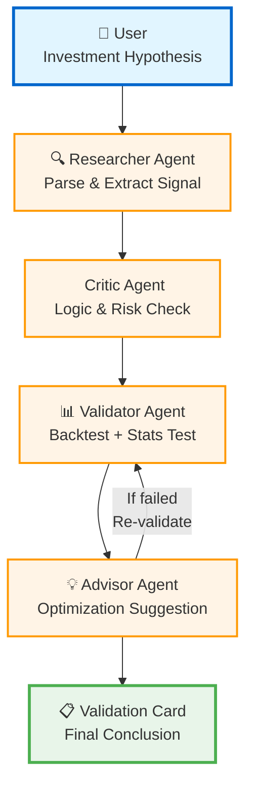
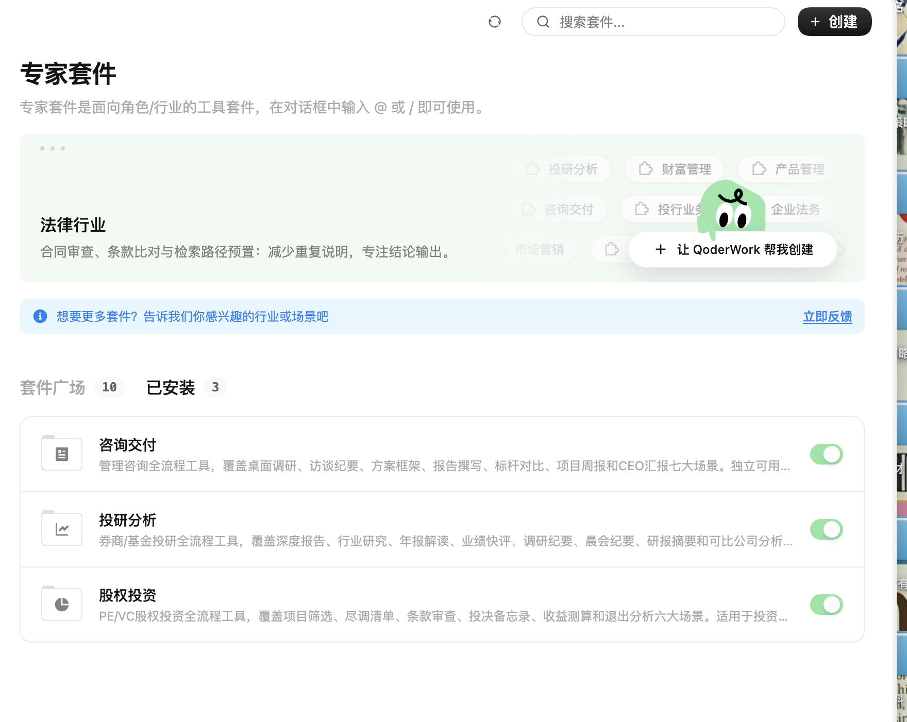

# AlphaPilot

## Multi-Agent Investment Research Copilot

> **Large models generate opinions; AlphaPilot validates them.**

AlphaPilot transforms natural-language investment hypotheses into statistically validated signals through a multi-agent workflow. Built for the QoderWork Hackathon.

---

## Architecture Diagram



---

## Project Overview

This project demonstrates a lightweight agent workflow:

1. Parse a research hypothesis from natural language
2. Convert it into a structured, testable signal
3. Compare the signal result with a simple benchmark
4. Produce a clear validation card and next-step suggestion

---

## Key Features

- **Natural Language Investment Hypothesis Parsing**: Convert "京东方A PB低于1倍时买入" into structured signals automatically
- **Multi-Agent Workflow**: Four specialized agents (Researcher, Critic, Validator, Advisor) collaborate to ensure robustness
- **Statistical Validation**: Paired t-test (scipy.stats) to determine if excess returns are statistically significant (p-value < 0.05)
- **Benchmark Comparison**: Strategy performance vs. buy-and-hold baseline with clear excess return calculation
- **Automatic Optimization Suggestions**: If initial hypothesis fails, Advisor Agent suggests stricter thresholds and triggers re-validation

---

## Demo Workflow

```mermaid
graph LR
    A[💡 Investment Idea] --> B[ Researcher Agent]
    B --> C[️ Critic Agent]
    C --> D[📊 Validator Agent]
    D --> E[💡 Advisor Agent]
    E --> F[📋 Validation Card]
    
    style A fill:#e1f5ff,stroke:#0066cc,stroke-width:2px
    style B fill:#fff4e6,stroke:#ff9900,stroke-width:2px
    style C fill:#fff4e6,stroke:#ff9900,stroke-width:2px
    style D fill:#fff4e6,stroke:#ff9900,stroke-width:2px
    style E fill:#fff4e6,stroke:#ff9900,stroke-width:2px
    style F fill:#e8f5e9,stroke:#4caf50,stroke-width:2px
```



### Agent Roles

| Agent | Responsibility | Output |
|-------|----------------|--------|
| **Researcher** 🔍 | Parse natural language, extract stock code, indicator, threshold | `{stock_code, field, threshold}` |
| **Critic** ️ | Check logic consistency, identify look-ahead bias | Risk assessment |
| **Validator** 📊 | Historical backtest, calculate returns, perform t-test | Returns, p-value, alpha |
| **Advisor**  | Analyze results, suggest optimization if failed | New threshold or conclusion |

---

## Demo Result

**Hypothesis**: "京东方A PB低于1倍时买入" (Buy BOE Technology when PB < 1.0)

### Initial Validation

```
PB < 1.0
─────────────────────────────────────┐
│ Strategy Annualized:   -22.52%      │
│ Benchmark Annualized:   13.42%      │
│ Excess Return (Alpha): -35.95%      │
│ p-value:                0.000       │
│ Conclusion:            ❌ Invalid   │
└─────────────────────────────────────┘
```

**Result**: Strategy significantly underperformed benchmark. Hypothesis rejected.

### ↓ Advisor Suggestion

```
 Original hypothesis failed. 
   Suggest trying a stricter threshold: PB < 0.8
```

### ↓ Optimized Validation

```
PB < 0.8
┌─────────────────────────────────────┐
│ Strategy Annualized:    19.86%      │
│ Benchmark Annualized:   13.42%      │
│ Excess Return (Alpha):   6.44%      │
│ p-value:                 0.004      │
│ Conclusion:            ✅ Valid     │
─────────────────────────────────────┘
```

**Result**: Strategy significantly outperformed benchmark with p-value = 0.004 < 0.05. **Significant Alpha confirmed!**

### Complete Closed Loop

```
Failure (PB < 1.0, Excess Return = -35.95%)
    ↓
Advisor Suggestion (Try PB < 0.8)
    ↓
Success (PB < 0.8, Excess Return = +6.44%, p = 0.004)
```

---

## Quick Start

```bash
git clone https://github.com/YutongXu243/AlphaPilot.git
cd AlphaPilot
pip install -r requirements.txt
python main.py
```

**Input Example**: `京东方A PB低于1倍时买入`

---

## Tech Stack

- **Python 3.8+**
- **Pandas**: Data manipulation and time series analysis
- **NumPy**: Numerical computations
- **SciPy**: Statistical testing (paired t-test)
- **Tushare** (optional): Financial data API
- **Rich**: Professional terminal UI

---

## Limitations

- **Hackathon MVP**: This is a rapid prototype, not production-ready software
- **Single-Stock Validation**: Currently supports longitudinal backtest for individual stocks only
- **No Transaction Costs**: Backtest excludes fees, slippage, and other trading frictions
- **Mock Data by Default**: Uses deterministic simulated data without Tushare token

---

## QoderWork Research Process

AlphaPilot was designed based on extensive research of QoderWork's three-layer capability system:

### Expert Plugin Exploration


*Figure 1: QoderWork provides 10 domain-specific expert plugins. AlphaPilot draws inspiration from equity-research, pe-vc-investment, and consulting-delivery plugins (shown enabled with green toggles).*

**Key Insights**:
- Professional workflows can be decomposed into standardized, automated steps
- Each plugin has clear responsibility boundaries and output formats
- Inspired the multi-agent architecture with specialized roles

### Skill & Connector Ecosystem



*Figure 2: QoderWork's skill marketplace and connector ecosystem enable professional financial analysis methods and external data integration.*

**Key Learnings**:
- Financial analysis requires rigorous statistical methods (e.g., p-value < 0.05 for significance)
- Standardized output formats ensure consistency and comparability
- Validated the need for statistical testing in Validator Agent

**Future Direction**:
- Browser connector: Fetch real-time company announcements and news
- Qichacha: Equity penetration and related party identification  
- PKULaw: Compliance review and regulatory risk assessment
- IM connectors (DingTalk/Feishu): Push validation results to decision makers

### Architecture Design

The AlphaPilot architecture was derived from mapping QoderWork capabilities to investment research workflow requirements:


**Design Philosophy**: Transform qualitative investment research into quantitative, statistically validated signals through a collaborative multi-agent workflow.

---

## Future Work

- Cross-sectional factor testing across entire market universe
- Integration with real-time financial databases (Tushare, Wind, Bloomberg)
- QoderWork Connector integration for IM notifications (DingTalk, Feishu)
- Additional agents: Risk Manager, Portfolio Optimizer, Report Generator
- LLM-enhanced parsing for complex investment logic (industry trends, policy impacts)

---

*Built for the QoderWork Hackathon. Let every investment idea stand the test of history.*
