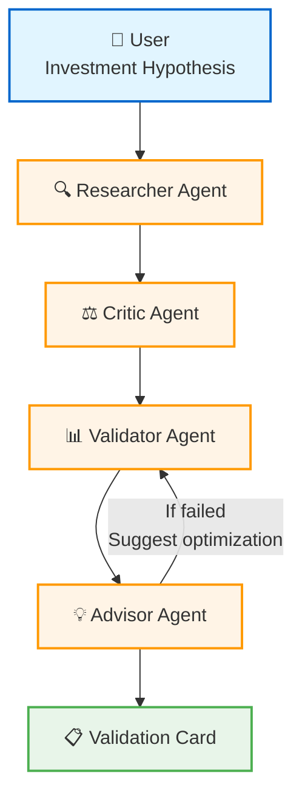

# AlphaPilot

AlphaPilot is a multi-agent research demo for the QoderWork Hackathon. It turns a natural-language research hypothesis into a simple testable signal and shows a validation card.

> Large models generate opinions; AlphaPilot validates them.

## Project Overview

This project demonstrates a lightweight agent workflow:

1. Parse a research hypothesis.
2. Convert it into a structured signal.
3. Compare the signal result with a simple benchmark.
4. Produce a clear validation card and next-step suggestion.

## Agent Architecture

AlphaPilot orchestrates four specialized agents to validate investment hypotheses:



| Agent | Role | Responsibility |
| :--- | :--- | :--- |
| **Researcher** 🔍 | Signal Extraction | Converts "BOE Technology is undervalued" into `PB < 1.0`. |
| **Critic** ⚖️ | Logical Review | Checks for look-ahead bias and logical consistency. |
| **Validator** 📊 | Statistical Testing | Runs backtests and calculates p-values via `scipy`. |
| **Advisor** 💡 | Optimization | Suggests parameter tuning (e.g., stricter thresholds) if the initial hypothesis fails. |

## Quick Start

```bash
git clone https://github.com/YutongXu243/AlphaPilot.git
cd AlphaPilot
pip install -r requirements.txt
python main.py
```

## 🎬 Case Study: BOE Technology / 京东方A (000725.SZ)

Demo hypothesis: `BOE Technology PB < 1.0`.

1.  **Initial Validation:** ❌ **Failed**. Excess return was negative against the benchmark.
2.  **Advisor Insight:** The threshold might be too loose. Suggested trying `PB < 0.8`.
3.  **Re-validation:** ✅ **Success**. The stricter threshold `PB < 0.8` produced positive excess return (+6.44%) and statistically significant alpha (p-value = 0.004).

## Tech Stack

- Python
- Pandas
- NumPy
- SciPy
- Tushare, optional
- Rich

## Limitations

- This is a Hackathon MVP, not financial advice.
- The default mode uses deterministic demo data when no Tushare token is configured.
- Current validation is single-company and demonstration-oriented.

## Future Work

- LLM-based parsing for complex research logic.
- Broader universe testing.
- Transaction-cost-aware validation.
- QoderWork connector integration.

---
*Built for the Hackathon. Let every investment idea stand the test of history.*
