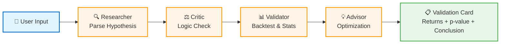

## 🏗️ Architecture

AlphaPilot orchestrates four specialized agents to validate investment hypotheses with statistical rigor:



### Agent Roles

| Agent | Icon | Responsibility | Output |
|-------|------|----------------|--------|
| **Researcher** | 🔍 | Parse natural language into structured signals | `PB < 1.0`, stock code |
| **Critic** | ⚖️ | Validate logic, check for biases | Risk assessment |
| **Validator** | 📊 | Historical backtest with statistical tests | Returns, p-value, alpha |
| **Advisor** | 💡 | Generate optimization suggestions | Stricter thresholds |

### Workflow

1. **User submits hypothesis**: "京东方A PB低于1倍时买入"
2. **Researcher extracts signal**: Stock `000725.SZ`, indicator `PB`, threshold `< 1.0`
3. **Critic validates logic**: Checks for look-ahead bias, data leakage
4. **Validator runs backtest**: 
   - Calculates strategy vs benchmark returns
   - Performs paired t-test (scipy.stats)
   - Computes p-value for statistical significance
5. **Advisor analyzes results**:
   - If successful → Generate validation card
   - If failed → Suggest optimization (e.g., `PB < 0.8`)
6. **Validation Card output**: Professional summary with metrics

### Validation Card Example

```
╭────────────── Initial Validation ───────────────╮
│   Strategy Annualized                 -22.52%   │
│   Benchmark Annualized                 13.42%   │
│   Excess Return (Alpha)               -35.95%   │
│   Statistical Significance    p-value = 0.000   │
│   Max Drawdown                        -75.71%   │
╰─────────────────────────────────────────────────╯
❌ 无效 (Invalid Hypothesis)
```

---

**Design Philosophy**: Minimalist black & white aesthetic with emoji icons for visual hierarchy. Optimized for GitHub README rendering and Hackathon demo presentations.
