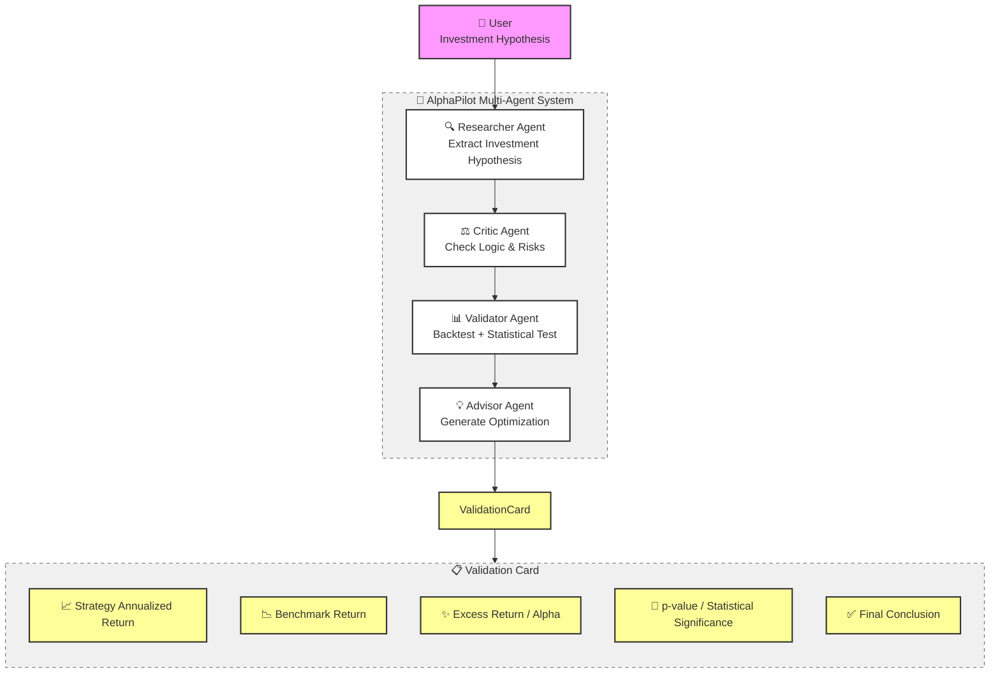
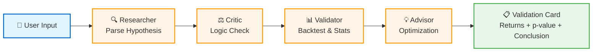
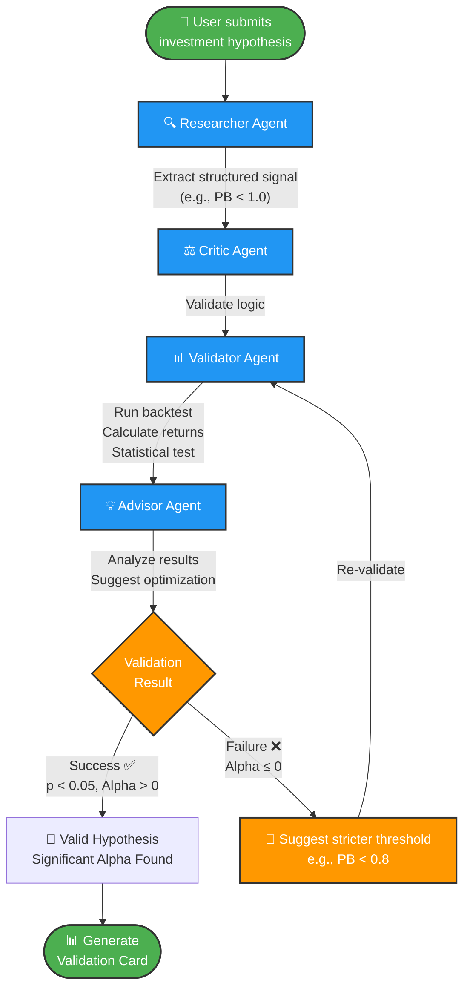

# AlphaPilot Architecture

## Multi-Agent Investment Research Copilot

### Mermaid Diagram (README Ready)



### Simplified Version (Better for GitHub README)



### Vertical Flow (Professional Documentation)



## Usage Instructions

### For GitHub README.md

Copy the "Simplified Version" mermaid code block above and paste it into your README.md file. GitHub natively renders mermaid diagrams.

### Example README Integration

```markdown
## 🏗️ Architecture

AlphaPilot uses a multi-agent workflow to validate investment hypotheses:


### Agent Roles

- **🔍 Researcher**: Parses natural language into structured signals
- **⚖️ Critic**: Checks for logical flaws and look-ahead bias
- **📊 Validator**: Runs historical backtests with statistical rigor
- **💡 Advisor**: Provides optimization suggestions when hypotheses fail
```

## Key Design Principles

1. **Minimalist Black & White**: Clean lines, high contrast
2. **Emoji Icons**: Visual hierarchy without color dependency
3. **Clear Flow**: Left-to-right or top-to-bottom progression
4. **Professional Labels**: Concise, technical terminology
5. **GitHub Compatible**: Native mermaid rendering support
